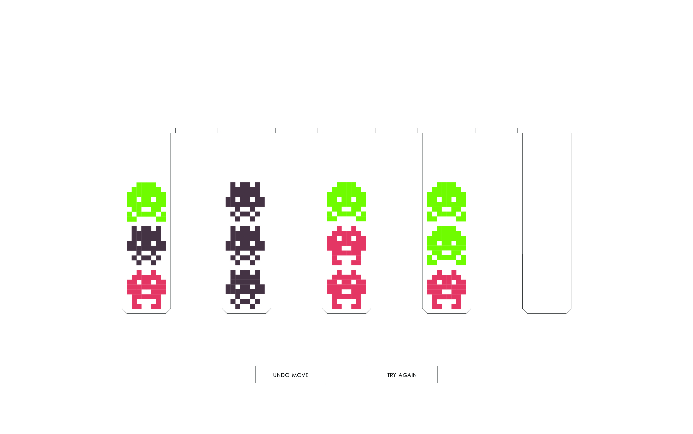

# Pixel Virus - Browser game

## How to play?

Pixel virus is a logic game, the main goal is to sort the viruses into the right flasks until there is only one color per tube.
Use the arrow keys to move through the flasks, select any flask, with the space bar, to move the virues lie on top in the flask to another flask.
You can place only move a virus on top of another virus if both of them have the same color.

Have fun!
